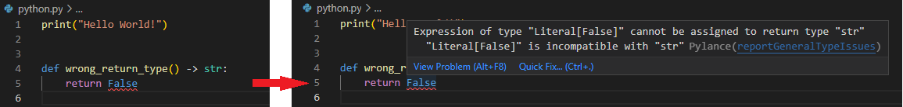

# Disclaimer
There are many ways to setup your python dev workstation on windows, and a lot of tools to choose from when managing your environments/packages/linting and other needs, this is just one setup that worked for me.

# Prerequisites

1. Install [VS Code](https://code.visualstudio.com/)
2. Install [Python]
   - `winget install Python.Python.3.11`

# Setting up environment variables

1. Create environment variable to tell `pipenv` where you want to store your virtual environments `setx WORKON_HOME "D:\DevRepository\virtualenvironments"`
	- Optionally you can set environment variable for `pipenv` to always create virtual environment in project folder `setx PIPENV_VENV_IN_PROJECT 1`
2. Restart your shell to get new environment variables loaded, you can verify if new environment variables are loaded with `printenv` in cmd or `Get-ChildItem -Path env:` in powershell.

# Install pipenv

1. `pip install pipenv`

# Creating a project
 
1. Create new project folder, and a sample python file for testing purposes, for example `python.py` containing sample code: `print("Hello World!")` 
2. To create virtual environment, navigate to project folder and run `pipenv --python 3.11` for specific python version.
3. For existing project with virtual environment already created, pipenv should be able to detect it, you can check it by issuing command `pipenv --venv` in project folder, if the project does not contain venv or it is not detected, you can create one as per step 2.
4. In case you need to remove virtual environment run `pipenv --rm` in project folder.

# VS Code configuration

1. In powershell or cmd navigate to your project directory and run `code .`. This will open your project folder in VS Code.
2. Install VS Code extensions for python
	- ms-python.python
3. In VS Code hit `ctrl+shift+p` and type `>Python: Select Interpreter`, if you have .venv in your project folder, VS Code should offer you to select interpreter from it,
if your virtual environment is elsewhere, select `Enter interpreter path...` and paste path to your python.exe from virtual environment (you can easily check for interpreter path for specific venv with `pipenv --py`).

## Configure Debugger

1. In VS Code hit `ctrl+shift+d` to open Run side panel.
2. In Select Environment click on `create a launch.json file`. Choose `Python`.
3. For Debug Configuration select `Python File`.
4. In .vscode folder there should be `launch.json` file created by now, with contents similar to this:
    ```json
    {
        "version": "0.2.0",
        "configurations": [
            {
                "name": "Python: Current File",
                "type": "python",
                "request": "launch",
                "program": "${file}",
                "console": "integratedTerminal"
            }
        ]
    }
    ```
5. Test debugging by selecting your `python.py`	file and hitting F5, you should see output similar to this:
    ```powershell
    PS C:\DevRepository\IAC\python-tools-setup>  cd 'c:\DevRepository\IAC\python-tools-setup'; & 'c:\DevRepository\IAC\python-tools-setup\.venv\Scripts\python.exe' 'c:\Users\bb5945\.vscode\extensions\ms-python.python-2020.10.332292344\pythonFiles\lib\python\debugpy\launcher' '52217' '--' 'c:\DevRepository\IAC\python-tools-setup\src\python.py'
    Hello World!
    ```

## Linting and Formatting

### Linting

1. In VS Code hit `ctrl+shift+p` and type `>Python: Select Linter`
2. Select `flake8`, do not click on VS Code notification to install missing linter, instead we will install it via pipenv for dev only, since you only need flake8 during development and not in your final product
3. At this point your `.\vscode\settings.json` should look similar to this
    ```json
    {
        "python.linting.flake8Enabled": true,
        "python.linting.enabled": true
    }
    ```
4. It is probably a good idea to disable VS Code's automatic activation of virtual environment, since we will be using pipenv and that is mostly redundant or even conflicting. Add a line to your settings.json `"python.terminal.activateEnvironment": false`:
    ```json
    {
        <...>
        "python.terminal.activateEnvironment": false
    }
    ```
5. Run `pipenv install flake8 --dev` 
6. Now you should have `Pipfile` created with the following contents

    ```toml

    [[source]]
    url = "https://pypi.org/simple"
    verify_ssl = true
    name = "pypi"

    [packages]

    [dev-packages]
    flake8 = "*"

    [requires]
    python_version = "3.11"
    python_full_version = "3.11.3"
    ```

7.  In your project root create file `.flake8` for configuring linting rules, for example to specify maximum line length:
    ```ini
    [flake8]
    max-line-length = 160
    ```

### Formatting

1. Install formatter by running `pipenv install autopep8 --dev` 
2. Add `"python.formatting.provider": "autopep8"` to `settigs.json`
3. From now on you should be able to format your .py files with `shift+alt+f`
4. Run `pipenv install isort --dev`, this allows you to right click in .py files and use `Sort Imports`.
5. Optionally in `settings.json` add language specific setting `"[python]"` to automatically sort imports on file save, after that `settings.json` should look similart to this:
    ```json
    {
        "python.terminal.activateEnvironment": false,
        "python.linting.flake8Enabled": true,
        "python.linting.enabled": true,
        "python.formatting.provider": "autopep8",
        "[python]": {
            "editor.codeActionsOnSave": {
                "source.organizeImports": true
            }
        }
    }
    ```

### Language server

1. Install VS Code extension `ms-python.vscode-pylance`
2. Select Yes when prompted to make Pylance the default language server. This will update your preferences, which you can also do manually by adding "python.languageServer": "Pylance" to your `settings.json` file using the text editor.
3. Optionally enable type checking by adding `"python.analysis.typeCheckingMode": "basic"`, final `settings.json` file:
    ```json
    {
        "python.pythonPath": ".venv\\Scripts\\python.exe",
        "python.terminal.activateEnvironment": false,
        "python.linting.pylintEnabled": false,
        "python.linting.flake8Enabled": true,
        "python.linting.enabled": true,
        "[python]": {
            "editor.defaultFormatter": "ms-python.python",
            "editor.codeActionsOnSave": {
                "source.organizeImports": true
            }
        },
        "python.languageServer": "Pylance",
        "python.analysis.typeCheckingMode": "basic"
    }
    ```
	Type checking in action:

    
 
### Project folder structure

In a common scenario where project files are nested into some subfolder like `src` python will fail to import modules from that subfolder, to fix that:

1. Create `.env` file in project root (you can change the location of .env file in vsocde settings, default is `"python.envFile": "${workspaceFolder}/.env"`).
2. Specify where python should look for additional modules by `PYTHONPATH=.\src` inside `.env` file.
